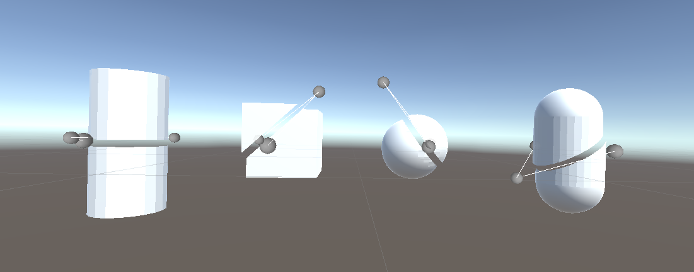

# DynamicMeshCutter

Features: 
- Slice a mesh according to a plane defined by three points.
- Using Compute Shaders to avoid performance issues.

Upcomming Features: 
- Fill the holes in the meshes.
- Improve triangles cuts on convex meshes.
- Handle Texture when a hole is filled.
